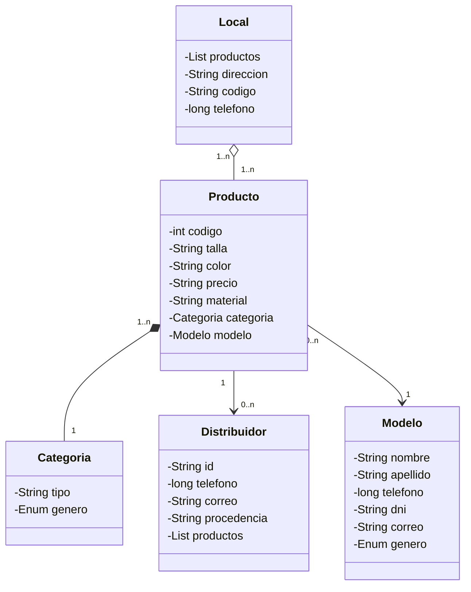

```mermaid
classDiagram

Producto "1..n" *-- "1" Categoria
Producto "1" --> "0..n" Distribuidor
Producto "0..n" --> "1" Modelo
Local "1..n" o-- "1..n" Producto


    class Producto {
        -int codigo
        -String talla
        -String color
        -String precio
        -String material
        -Categoria categoria
        -Modelo modelo

    }


    class Categoria {
        -String tipo
        -Enum genero
    }


    class Distribuidor {
        -String id
        -long telefono
        -String correo
        -String procedencia
        -List<Producto> productos
    }


    class Modelo {
        -String nombre
        -String apellido
        -long telefono
        -String dni
        -String correo
        -Enum genero
    }


    class Local {
        -List<Producto> productos
        -String direccion
        -String codigo
        -long telefono
    }
```